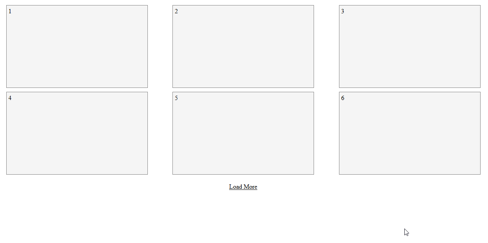

# Ui-Component-LoadMore-(Static Content)➕ 🖼

## Show more content (cards, blocks, images etc) on Click 🎭 (No Database)

### Show more content on Page made with HTML5, CSS3 & Vanilla Javascript only 👍👌 .

Basic, Simple and Easy To Use. 😎

## DEMO😍:

---

## [TRY HERE](arslanameer.github.io/Ui-Component-LoadMore-Static-Content) 😍

[ © Copyrights [Arslan Ameer](http://www.arslanameer.cf) ]

---

# 🔐LICENSE:

Ui-Component-LoadMore-(Static Content) © Copyright 2018 by **[Arslan Ameer](http://www.arslanameer.cf/)**

Licensed under the Apache License, Version 2.0 (the "License");
you may not use this file except in compliance with the License.
You may obtain a copy of the License at

    http://www.apache.org/licenses/LICENSE-2.0

Unless required by applicable law or agreed to in writing, software
distributed under the License is distributed on an "AS IS" BASIS,
WITHOUT WARRANTIES OR CONDITIONS OF ANY KIND, either express or implied.
See the License for the specific language governing permissions and
limitations under the License..
